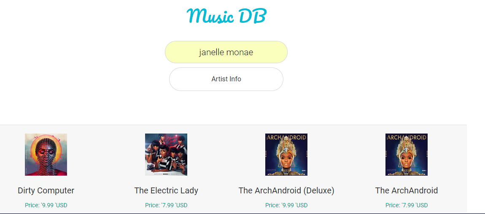

# Music Artist Database
User may enter an artist name and view artist information as well as album prices.

**Link to project:** https://zen-bose-c1b511.netlify.com/

## How It's Made:

**Tech used:** HTML5, CSS3, JavaScript, AudioDB and iTunes' APIs.

This project was written in JavaScript using the fetch method to access the iTunes API. When a user enters a an artist, the API returns the Artist music collections and prices. The AudioDB API then shares the artist information with the user, including a biography. This project was designed using CSS3.

## Lessons Learned:

This project furthered my understanding of APIs.

## Related Projects:
Take a look at these projects that I have in my portfolio:

**New Recipe & Fact:** https://friendly-snyder-f7f591.netlify.com/

**NASA Photo API:** https://gallant-pasteur-e1c256.netlify.com/

**Pokemon API:** https://admiring-cray-e04cdb.netlify.com/
